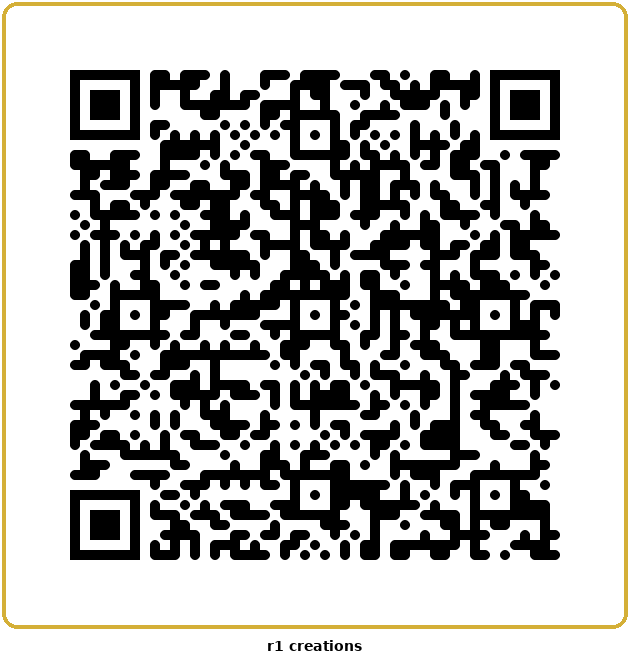

# Clue with R1 — Clue

**v1.0.0** — Digital Clue (murder mystery deduction) built for the Rabbit R1 screen (240x282).

**Live URL:** https://player585.github.io/Clue-with-R1/

## Install on R1

1. Scroll to **Creations** card
2. Tap **Create** → **Add via QR code**
3. Scan the QR code above
4. Done

## How to Play

3–6 players sit around a table and pass the R1 between turns. The R1 is the board, the deck, and the detective notepad.

**Setup:** Pick player count → each player picks a character (Scarlet, Mustard, Plum, Green, White, Peacock) → R1 deals cards privately via whisper or on-screen.

**Each Turn:**
1. **Move** — Pick an adjacent room on the 3x3 map (corner rooms have secret passages)
2. **Suggest** — Name a suspect + weapon in your current room
3. **Refute** — Clockwise, the first player with a matching card shows it privately
4. **Notepad** — Auto-updates; browse manually anytime

**Accusation** — Risk it all: name the suspect, weapon, and room. Correct = you win. Wrong = eliminated.

## Features

- **Whisper Mode** — Hold R1 to ear, private card reveals via TTS through earpiece
- **Visual Mode** — All information also shown on screen with privacy pass screens
- **Detective Notepad** — Auto-tracks refutations, manual marking (clear/has/maybe)
- **9 Room Map** — 3x3 grid with adjacency rules + 4 secret passages
- **Privacy Screens** — Blank screens between turns prevent peeking
- **Full Clue Logic** — Envelope, deal, refutation chain, elimination on wrong accusation

## R1 Controls

| Input | Action |
|-------|--------|
| **Scroll Wheel** | Navigate menus, rooms, notepad rows |
| **PTT Click** | Confirm selection, advance phase |
| **Long Press** | Open notepad / cycle notepad tabs / go back |
| **Whisper Icon** | Toggle TTS whisper on/off (header) |

## Keyboard (Browser Testing)

| Key | Action |
|-----|--------|
| Arrow Up/Down | Scroll/navigate |
| Enter/Space | Confirm (PTT) |
| Escape/Backspace | Notepad / back (Long Press) |
| Arrow Left/Right | Cycle notepad tabs |

## Game Components

- **6 Suspects:** Scarlet, Mustard, Plum, Green, White, Peacock
- **6 Weapons:** Knife, Candlestick, Revolver, Rope, Lead Pipe, Wrench
- **9 Rooms:** Kitchen, Ballroom, Conservatory, Dining Room, Billiard Room, Library, Lounge, Hall, Study
- **Secret Passages:** Kitchen↔Study, Conservatory↔Lounge

## Tech

- Single `index.html`, zero dependencies, zero build
- Web Speech API for TTS whisper mode
- R1 hardware events (scrollUp, scrollDown, sideClick, longPressStart)
- Dark theme with gold/burgundy Clue aesthetic
